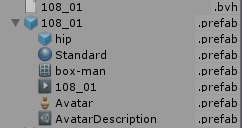
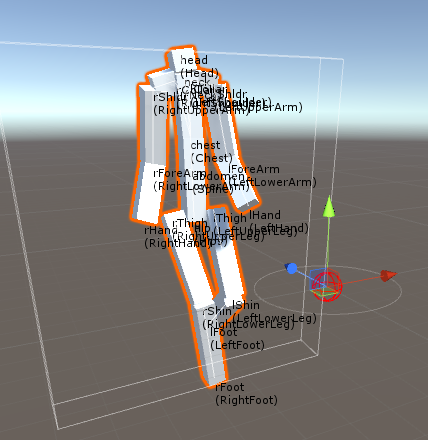
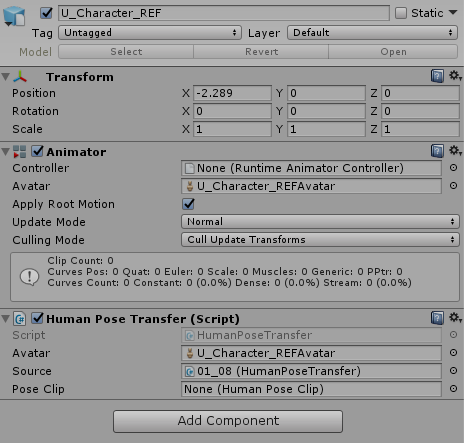
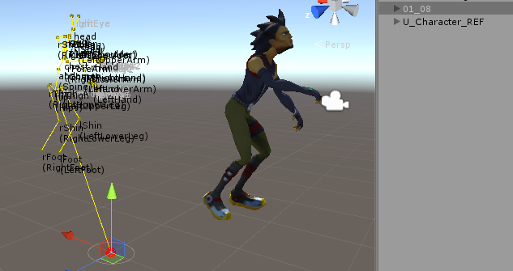
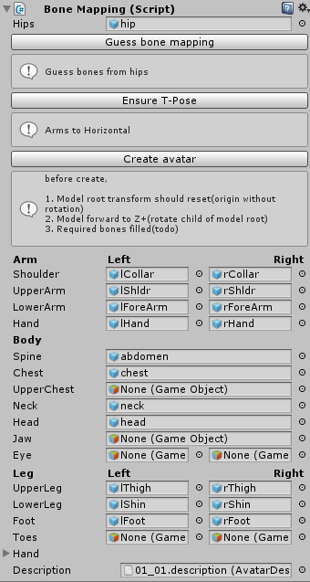

# UniHumanoid

Unity humanoid utility with bvh importer.

# License

* [MIT](./LICENSE.md)

# Sample Scene

## RuntimeLoader
* Scenes/RuntimeBvhLoader.unity

## RuntimeLoader and PoseTransfer
load BVH and transfer pose to any model with humanoid avatar.

* Scenes/PoseTransfer.unity


## BVH files

* https://sites.google.com/a/cgspeed.com/cgspeed/motion-capture
* http://mocapdata.com/
* http://www.thetrailerspark.com/download/Mocap/Packed/EYES-JAPAN/BVH/

## BVH Asset Importer

Drop bvh file to Assets folder.
Then, AssetPostprocessor import bvh file.

* create a hierarchy prefab 
* create a humanoid Avatar
* create a legacy mode AnimationClip
* create a skinned mesh for preview



Instanciate prefab to scene.



That object can play. 


## BVH Runtime Importer

```cs
var context = new UniHumanoid.ImporterContext
{
    Path = path
};
UniHumanoid.BvhImporter.Import(context);
GameObject root = context.Root;
```

## Transfer humanoid pose to other humanoid

Set avatar to HumanPoseTransfer attached to bvh gameobject.

Instanciate target humanoid model from asset, For example fbx.
Attach HumanPoseTransfer to new human model and set to bvh HumanPoseTransfer's Source of bvh gameobject. 


Then, Bvh animtion copy to new humanoid ! 


## BoneMapping

This script help create human avatar from GameObject hierarchy.
First, attach this script to GameObject that has Animator with HumanAvatar.

Next, setup below.

* model position is origin
* model look at +z orientation
* model root node rotation is Quatenion.identity
* Set hips bone.

press Guess bone mapping.
If fail to guess bone mapping, you can set bones manually.

Optional, press Ensure T-Pose.
Create avatar.



These humanoids imported by [UniGLTF](https://github.com/ousttrue/UniGLTF) and created human avatar by BoneMapping. 


